General steps to install VM Ware into a regular PC for home practice labs. Then you are able to create and maintain VMS using multiple OS versions.

Create a new VM

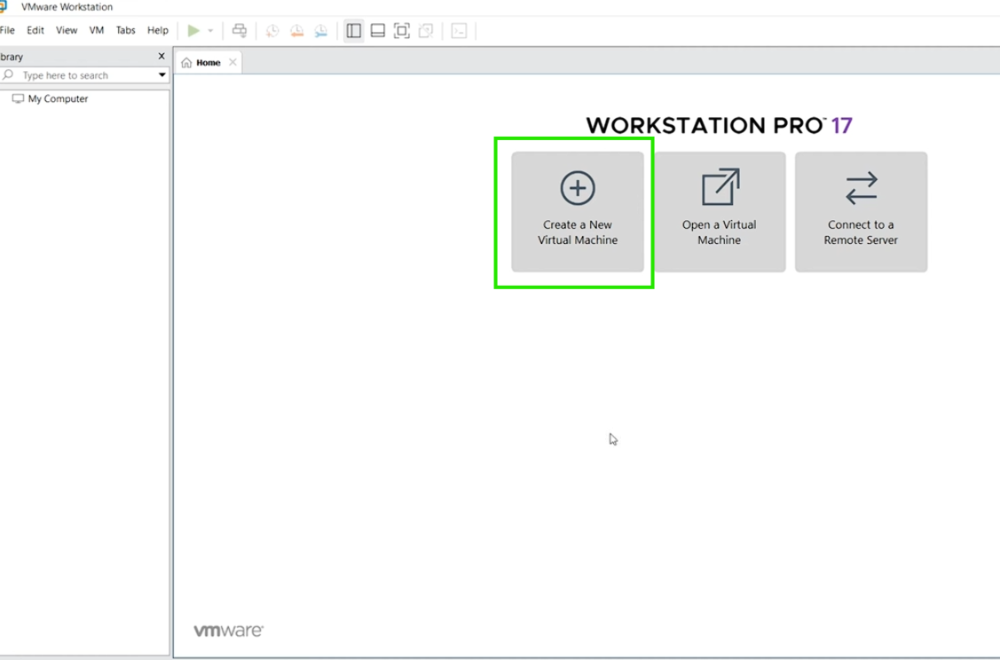

Select Custom

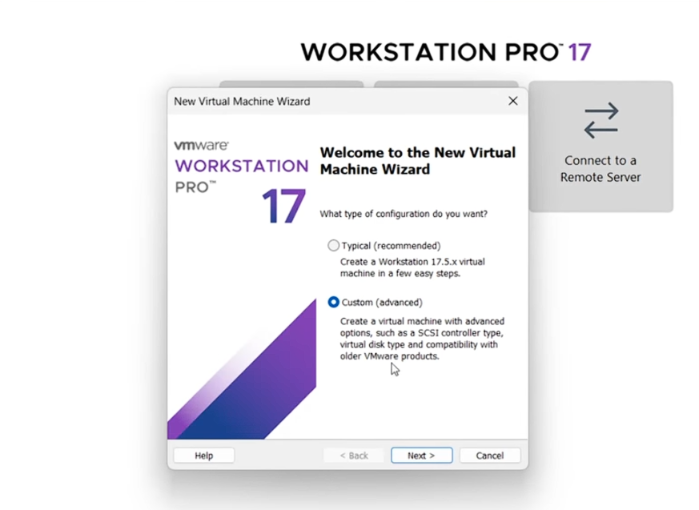

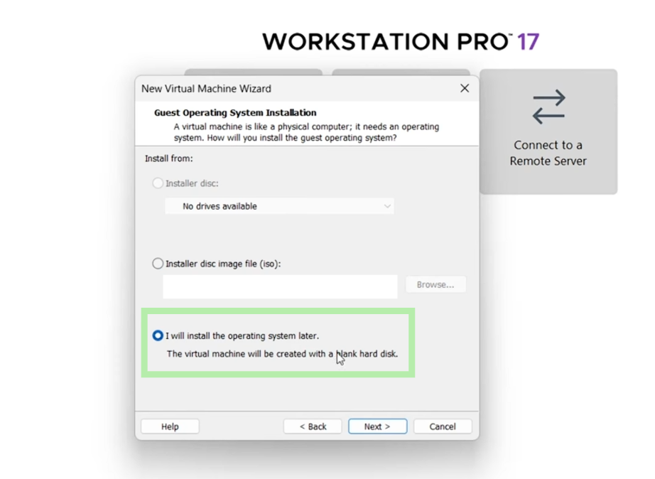

Select the OS of your choice -  I selected a Windows 10 ISO

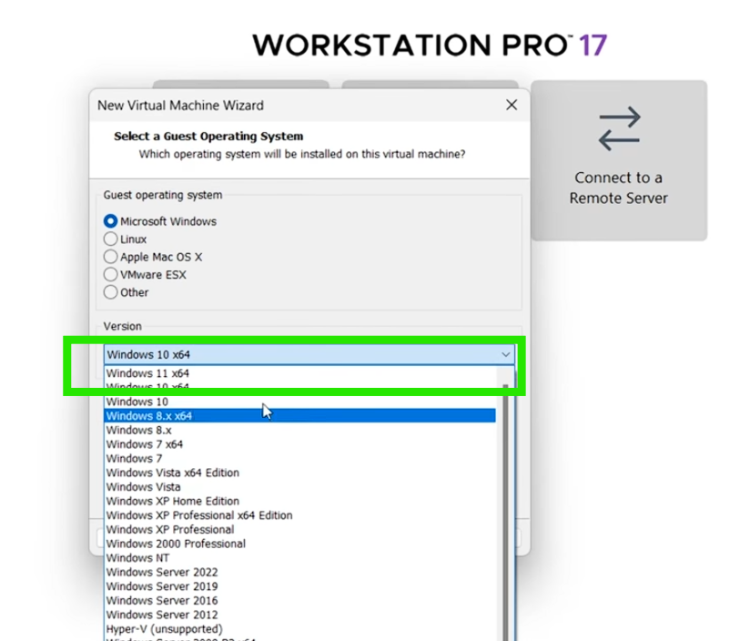

Name the VM appropiately

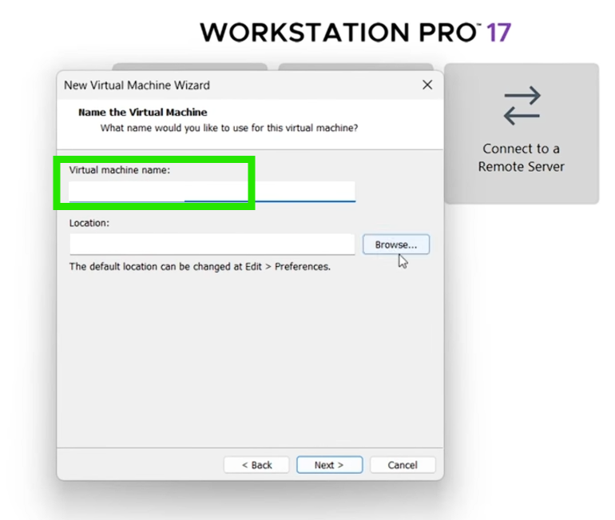

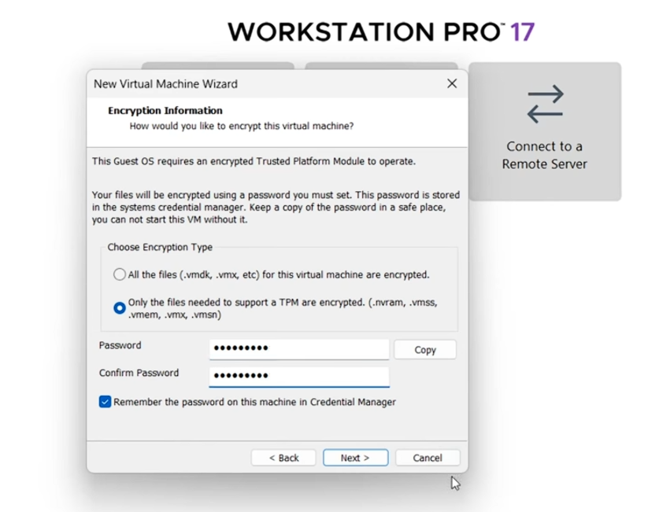
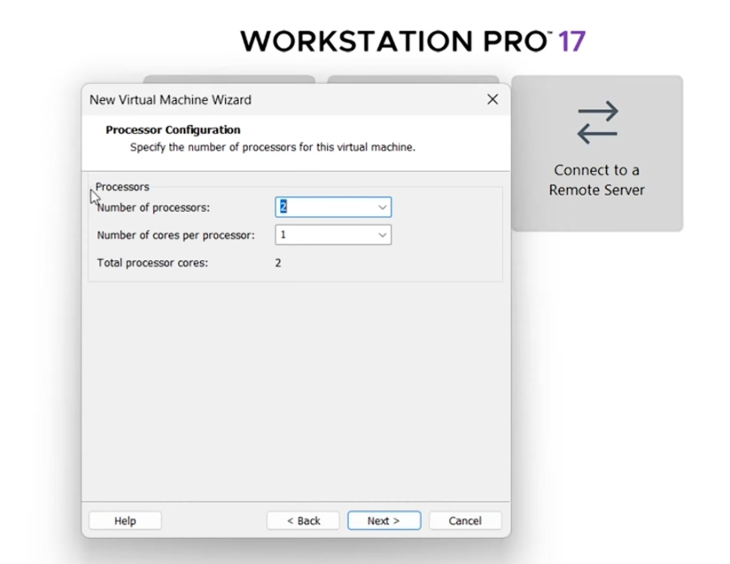
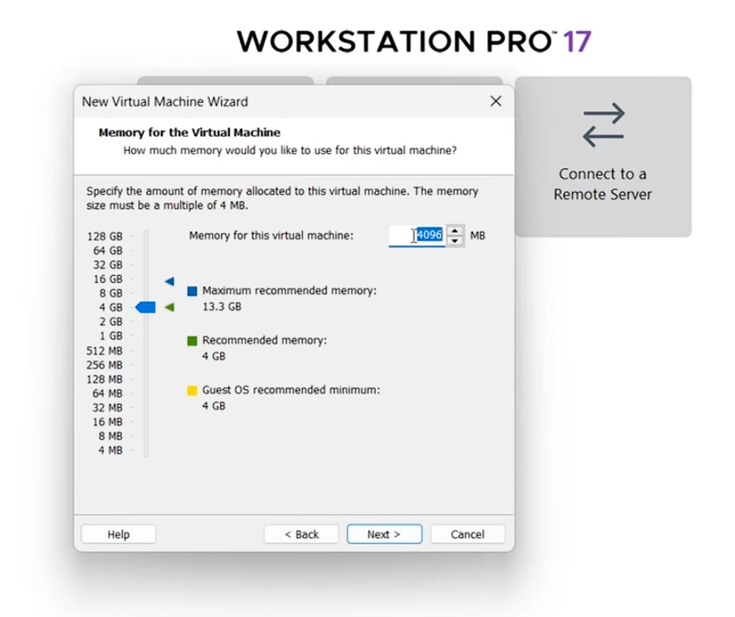
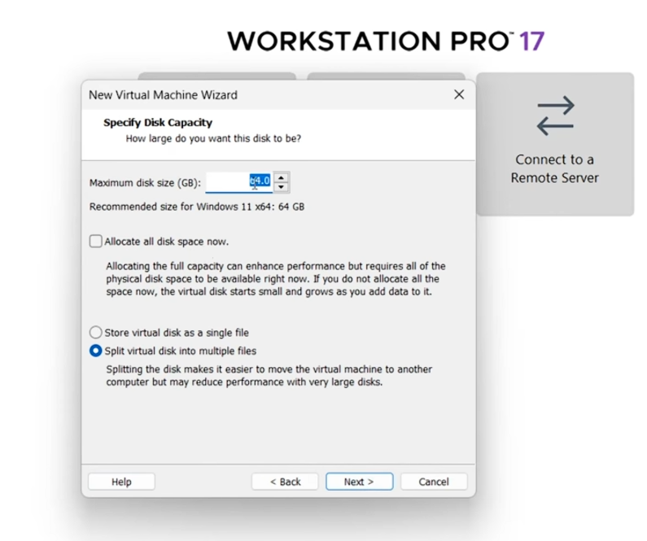
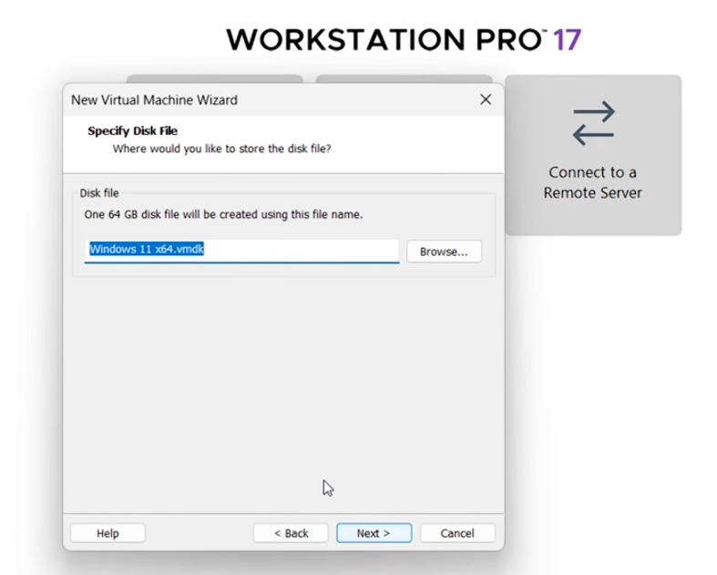
Configure Settings and customize it

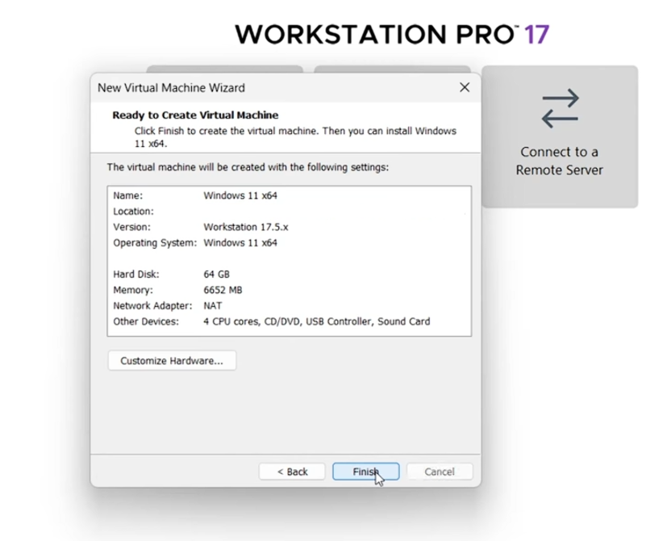
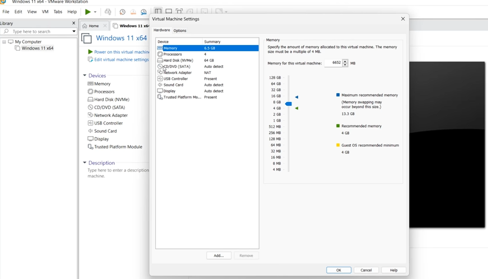

Verification after my Virtual machines have been stacked and installed and ready for use.
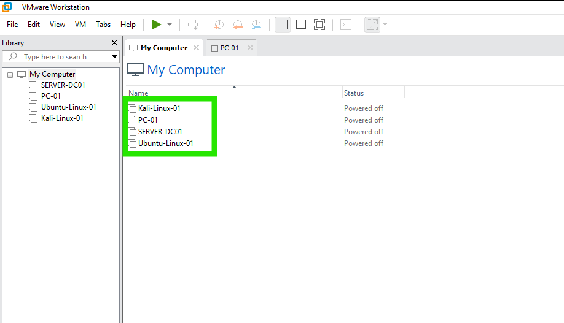
